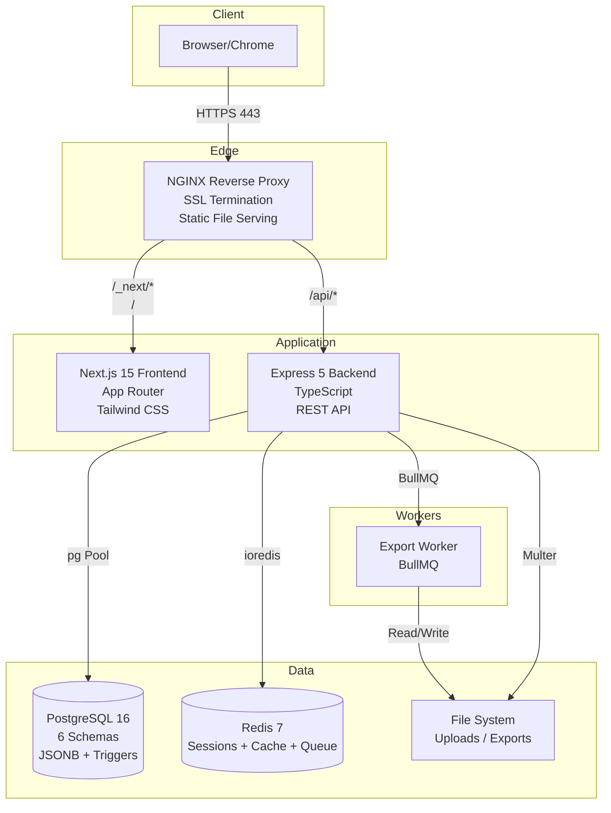
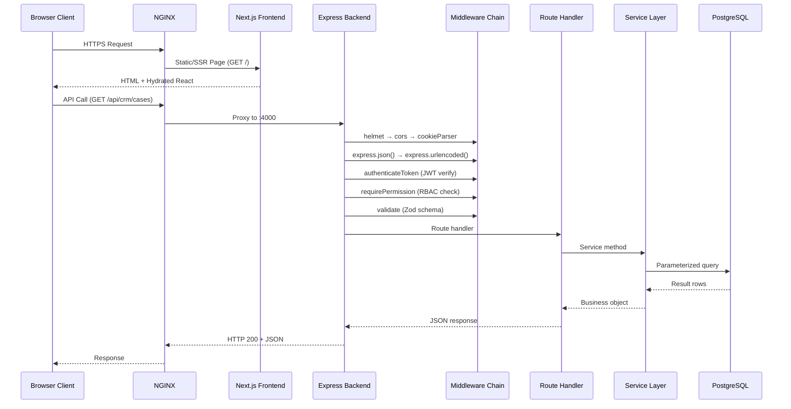
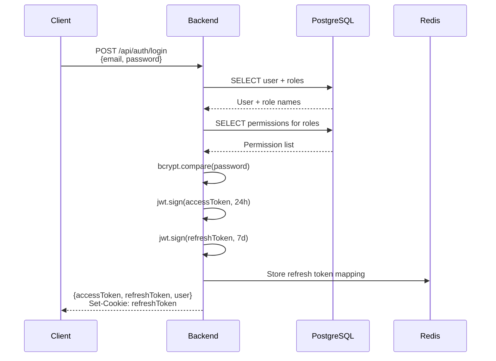
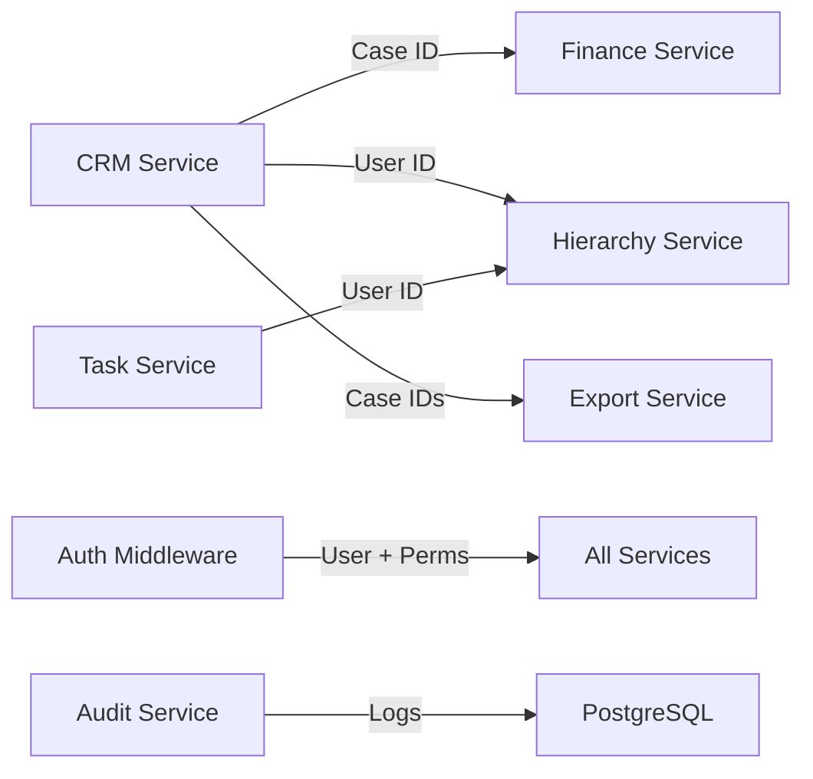
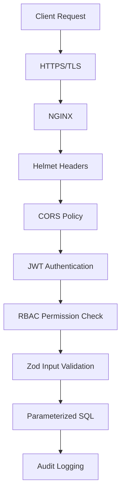

# Architecture Documentation

## High-Level Architecture

## Request Lifecycle

## Database Schema Architecture

```mermaid
erDiagram
    auth_schema_users ||--o{ auth_schema_user_roles : has
    auth_schema_roles ||--o{ auth_schema_user_roles : assigned_to
    auth_schema_roles ||--o{ auth_schema_role_permissions : has
    auth_schema_permissions ||--o{ auth_schema_role_permissions : granted_to
    auth_schema_users ||--o{ auth_schema_user_hierarchy : manages
    auth_schema_users ||--o{ auth_schema_user_hierarchy : reports_to
    auth_schema_teams ||--o{ auth_schema_team_members : includes
    auth_schema_users ||--o{ auth_schema_team_members : member_of

    crm_schema_cases ||--o{ crm_schema_case_assignments : assigned
    auth_schema_users ||--o{ crm_schema_case_assignments : assignee
    crm_schema_cases ||--o{ crm_schema_documents : contains
    crm_schema_cases ||--o{ crm_schema_case_notes : has
    crm_schema_cases ||--o{ crm_schema_case_status_history : tracks

    finance_schema_cam_templates ||--o{ finance_schema_cam_fields : defines
    finance_schema_cam_templates ||--o{ finance_schema_cam_entries : used_in
    finance_schema_obligation_templates ||--o{ finance_schema_obligation_fields : defines
    finance_schema_obligation_templates ||--o{ finance_schema_obligation_sheets : used_in
    finance_schema_obligation_sheets ||--o{ finance_schema_obligation_items : contains

    task_schema_tasks ||--o{ task_schema_task_comments : has
```

## Authentication Flow

## Service Layer Design

The backend follows a **Controller-Service** pattern:

| Layer | Responsibility | Example |
|-------|---------------|---------|
| **Route** | URL mapping + middleware chain | `crm.routes.ts` |
| **Controller** | HTTP handling, request/response | `CRMController.createCase` |
| **Service** | Business logic, database operations | `CRMService.createCase` |
| **Validator** | Input validation (Zod) | `createCaseSchema` |
| **Middleware** | Cross-cutting concerns | `authenticateToken`, `requirePermission` |

## Caching Strategy

| Data | Cache Layer | TTL | Invalidation |
|------|------------|-----|--------------|
| User permissions | Redis | Session lifetime | On role change |
| Export job status | Redis (BullMQ) | Until completion | Job completion |
| Session tokens | Redis | 7 days | Logout |

## State Management

### Frontend
- **Auth state**: React Context (`AuthContext`) with localStorage persistence
- **Server state**: Direct API calls via service functions (no React Query/SWR)
- **Form state**: useState hooks
- **Global UI**: Component-level state

### Backend
- **Stateless**: No server-side sessions (JWT-based)
- **RBAC cache**: Permissions cached in `req.userPermissions` per request

## Scalability Design

- **Horizontal**: NGINX can load-balance multiple backend instances
- **Database**: Read replicas possible; JSONB for flexible schema evolution
- **Exports**: Async processing via BullMQ workers to avoid blocking requests
- **File uploads**: Memory storage (Multer) — for production, switch to S3/streaming
- **Frontend**: Static export capability via Next.js

## Multi-Service Interaction

## Security Layers

