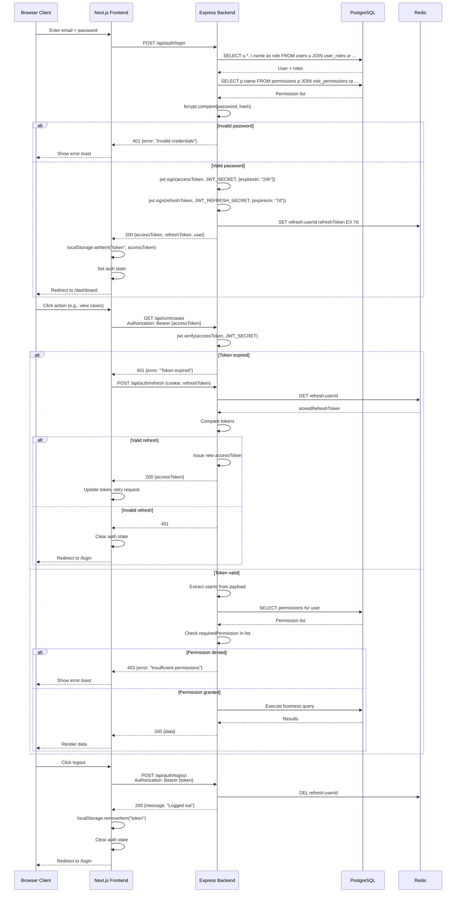
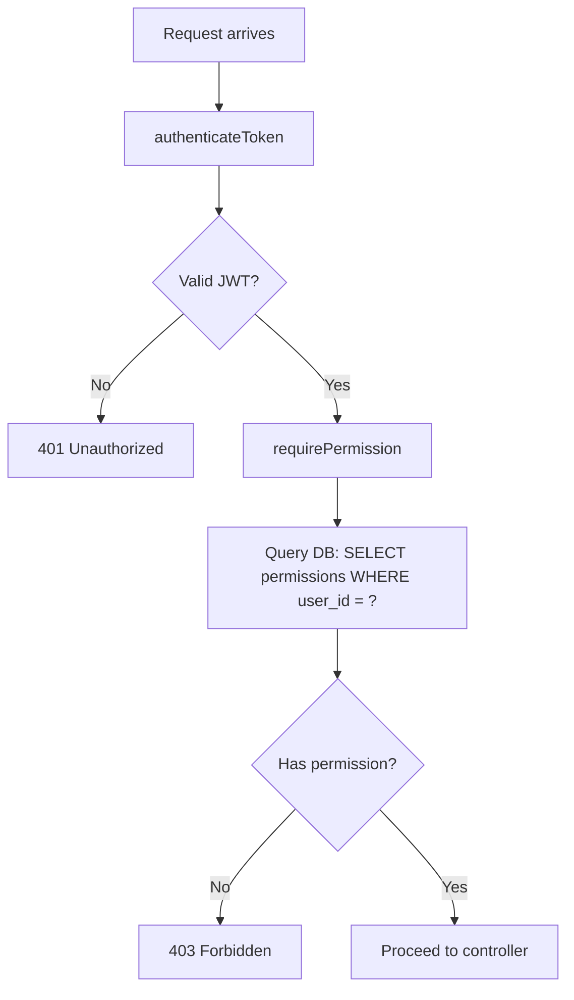

# Authentication Flow

## Sequence Diagram



## JWT Token Structure

### Access Token
```json
{
  "userId": "uuid",
  "email": "user@example.com",
  "roles": ["admin"],
  "permissions": ["crm.case.view", "crm.case.create"],
  "iat": 1703001600,
  "exp": 1703088000
}
```

### Refresh Token
```json
{
  "userId": "uuid",
  "type": "refresh",
  "iat": 1703001600,
  "exp": 1703606400
}
```

## Middleware Chain

```
Request → helmet → cors → cookieParser → express.json → Route Handler
                                              ↓
                                    authenticateToken (JWT verify)
                                              ↓
                                    requirePermission (DB permission check)
                                              ↓
                                    validate (Zod schema validation)
                                              ↓
                                    Controller → Service → DB
```

## Permission Check Flow



## Token Storage

| Token | Storage | Accessible By | Expiry |
|-------|---------|--------------|--------|
| Access Token | `localStorage` | JavaScript | 24h |
| Refresh Token | HTTP-only Cookie | Server only | 7d |

## Security Considerations

1. **Access token in localStorage**: Vulnerable to XSS. Mitigated by React's auto-escaping.
2. **Refresh token as HTTP-only cookie**: Protected from XSS, but needs CSRF protection.
3. **No CSRF token currently implemented**: Add Double Submit Cookie pattern for state-changing operations.
4. **Permission cache**: Currently fetched from DB on every request. Consider caching in Redis with invalidation on role changes.
