# Database Documentation

## Overview

PostgreSQL 16 with 6 schemas, UUID primary keys, JSONB for flexible data, and triggers for business logic enforcement.

## Schema Map

| Schema | Purpose | Tables |
|--------|---------|--------|
| `auth_schema` | Users, roles, permissions, teams, hierarchy | 8 |
| `admin_schema` | Announcements | 1 |
| `audit_schema` | Audit logs, error logs | 2 |
| `crm_schema` | Cases, assignments, documents, notes, notifications, customer details | 10+ |
| `finance_schema` | CAM, obligation, eligibility | 8 |
| `task_schema` | Tasks, comments | 2 |

## ER Diagram

```mermaid
erDiagram
    auth_schema_users {
        UUID id PK
        VARCHAR email UK
        VARCHAR password_hash
        VARCHAR first_name
        VARCHAR last_name
        BOOLEAN is_active
        TIMESTAMP created_at
        TIMESTAMP updated_at
    }

    auth_schema_roles {
        UUID id PK
        VARCHAR name UK
        TEXT description
        TIMESTAMP created_at
        TIMESTAMP updated_at
    }

    auth_schema_permissions {
        UUID id PK
        VARCHAR name UK
        TEXT description
        TIMESTAMP created_at
        TIMESTAMP updated_at
    }

    auth_schema_user_roles {
        UUID id PK
        UUID user_id FK
        UUID role_id FK
        TIMESTAMP created_at
    }

    auth_schema_role_permissions {
        UUID id PK
        UUID role_id FK
        UUID permission_id FK
        TIMESTAMP created_at
    }

    auth_schema_teams {
        UUID id PK
        VARCHAR name
        TEXT description
        TIMESTAMP created_at
        TIMESTAMP updated_at
    }

    auth_schema_team_members {
        UUID id PK
        UUID team_id FK
        UUID user_id FK
        TIMESTAMP created_at
    }

    auth_schema_user_hierarchy {
        UUID id PK
        UUID manager_id FK
        UUID subordinate_id FK
        TIMESTAMP created_at
    }

    crm_schema_cases {
        UUID id PK
        VARCHAR case_number UK
        VARCHAR customer_name
        VARCHAR customer_email
        VARCHAR customer_phone
        VARCHAR loan_type
        DECIMAL loan_amount
        VARCHAR current_status
        UUID created_by FK
        TIMESTAMP created_at
        TIMESTAMP updated_at
    }

    crm_schema_case_assignments {
        UUID id PK
        UUID case_id FK
        UUID assigned_to FK
        UUID assigned_by FK
        TIMESTAMP assigned_at
    }

    crm_schema_documents {
        UUID id PK
        UUID case_id FK
        VARCHAR file_name
        VARCHAR file_path
        VARCHAR mime_type
        BIGINT file_size
        UUID uploaded_by FK
        TIMESTAMP uploaded_at
    }

    crm_schema_case_notes {
        UUID id PK
        UUID case_id FK
        TEXT note
        UUID created_by FK
        TIMESTAMP created_at
    }

    crm_schema_case_status_history {
        UUID id PK
        UUID case_id FK
        VARCHAR from_status
        VARCHAR to_status
        UUID changed_by FK
        TIMESTAMP changed_at
        TEXT remarks
    }

    finance_schema_cam_templates {
        UUID id PK
        VARCHAR loan_type
        VARCHAR template_name
        JSONB sections
        BOOLEAN is_active
        UUID created_by FK
        TIMESTAMP created_at
        TIMESTAMP updated_at
    }

    finance_schema_cam_fields {
        UUID id PK
        UUID template_id FK
        VARCHAR section_name
        VARCHAR field_key
        VARCHAR label
        VARCHAR field_type
        BOOLEAN is_mandatory
        BOOLEAN is_user_addable
        INTEGER order_index
        TEXT default_value
        JSONB validation_rules
        JSONB select_options
        TIMESTAMP created_at
    }

    finance_schema_cam_entries {
        UUID id PK
        UUID case_id FK
        UUID template_id FK
        JSONB template_snapshot
        JSONB cam_data
        JSONB user_added_fields
        INTEGER version
        UUID created_by FK
        TIMESTAMP created_at
    }

    finance_schema_obligation_templates {
        UUID id PK
        VARCHAR template_name UK
        JSONB sections
        BOOLEAN is_active
        UUID created_by FK
        TIMESTAMP created_at
        TIMESTAMP updated_at
    }

    finance_schema_obligation_fields {
        UUID id PK
        UUID template_id FK
        VARCHAR field_key
        VARCHAR label
        VARCHAR field_type
        BOOLEAN is_mandatory
        BOOLEAN is_repeatable
        INTEGER order_index
        TEXT default_value
        JSONB validation_rules
        JSONB select_options
        TIMESTAMP created_at
    }

    task_schema_tasks {
        UUID id PK
        VARCHAR title
        TEXT description
        UUID assigned_to FK
        UUID assigned_by FK
        VARCHAR direction
        VARCHAR status
        TIMESTAMP due_date
        TIMESTAMP created_at
        TIMESTAMP updated_at
    }

    auth_schema_users ||--o{ auth_schema_user_roles : has
    auth_schema_roles ||--o{ auth_schema_user_roles : assigned_to
    auth_schema_roles ||--o{ auth_schema_role_permissions : has
    auth_schema_permissions ||--o{ auth_schema_role_permissions : granted_to
    auth_schema_users ||--o{ auth_schema_user_hierarchy : manages
    auth_schema_users ||--o{ auth_schema_user_hierarchy : reports_to
    auth_schema_teams ||--o{ auth_schema_team_members : includes
    auth_schema_users ||--o{ auth_schema_team_members : member_of
    crm_schema_cases ||--o{ crm_schema_case_assignments : assigned
    auth_schema_users ||--o{ crm_schema_case_assignments : assignee
    crm_schema_cases ||--o{ crm_schema_documents : contains
    crm_schema_cases ||--o{ crm_schema_case_notes : has
    crm_schema_cases ||--o{ crm_schema_case_status_history : tracks
    finance_schema_cam_templates ||--o{ finance_schema_cam_fields : defines
    finance_schema_cam_templates ||--o{ finance_schema_cam_entries : used_in
    finance_schema_obligation_templates ||--o{ finance_schema_obligation_fields : defines
```



## Key Design Decisions

### UUID Primary Keys
All tables use `UUID` with `uuid_generate_v4()` default. This enables distributed ID generation and prevents enumeration attacks.

### JSONB for Flexible Schema
- `cam_data` / `obligation_items.item_data` — Stores dynamic template-driven field values
- `template_snapshot` — Preserves template state at creation time for versioning
- `validation_rules` / `select_options` — Per-field configuration without schema changes
- `details` (audit logs) — Structured audit metadata

### Database Triggers

| Trigger | Table | Purpose |
|---------|-------|---------|
| `trigger_set_case_number` | `crm_schema.cases` | Auto-generates case numbers: `PREFIX-YYYYMMDD-USERID-XXXXX` |
| `trigger_update_cases_updated_at` | `crm_schema.cases` | Auto-updates `updated_at` |
| `trigger_check_hierarchy_cycle` | `auth_schema.user_hierarchy` | Prevents circular reporting structures |
| `trigger_validate_task_assignment` | `task_schema.tasks` | Enforces downward/upward assignment rules |

### Indexes

Strategic indexes on:
- Foreign keys (all FK columns)
- Search fields (`email`, `case_number`, `current_status`)
- Filter fields (`is_active`, `created_at`, `status`)
- Composite indexes for common queries

## Query Patterns

### Recursive CTE for Subordinates
```sql
WITH RECURSIVE subordinates AS (
  SELECT subordinate_id FROM auth_schema.user_hierarchy WHERE manager_id = $1
  UNION
  SELECT uh.subordinate_id FROM auth_schema.user_hierarchy uh
  INNER JOIN subordinates s ON s.subordinate_id = uh.manager_id
)
SELECT * FROM auth_schema.users WHERE id IN (SELECT subordinate_id FROM subordinates);
```

### Case Number Generation
Uses a PostgreSQL function `crm_schema.generate_case_number(loan_type, user_id)` that:
1. Maps loan type to prefix (PL, BL, HL, etc.)
2. Counts existing cases for the day
3. Generates sequential number with zero-padding

## Migrations Strategy

Individual migration files in `backend/src/db/migrate-*.ts`. Each migration is self-contained and idempotent where possible (using `IF NOT EXISTS`, `ON CONFLICT`).

Key migrations:
- `migrate.ts` — Initial schema
- `migrate-phase4-tasks-notes.ts` — Tasks & notes schema
- `migrate-finance-templates.ts` — CAM & obligation templates
- `migrate-announcements-enhancements.ts` — Announcements with images
- `migrate-recognitions.ts` — Employee recognitions
- `migrate-customer-detail-sheets.ts` — Customer detail Excel parsing
