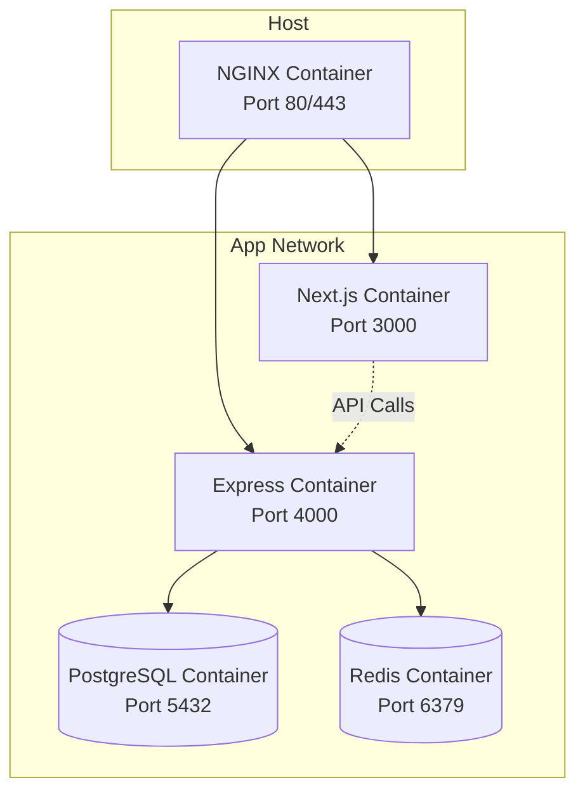

# Deployment Documentation

## Docker Architecture



## Docker Files

### Backend Dockerfile
```dockerfile
FROM node:20-alpine
WORKDIR /app
COPY package*.json ./
RUN npm ci --only=production
COPY . .
RUN npm run build
EXPOSE 4000
CMD ["npm", "start"]
```

### Frontend Dockerfile
```dockerfile
FROM node:20-alpine
WORKDIR /app
COPY package*.json ./
RUN npm ci
COPY . .
RUN npm run build
EXPOSE 3000
CMD ["npm", "start"]
```

## Docker Compose Setup

```yaml
version: '3.8'
services:
  nginx:
    image: nginx:alpine
    ports:
      - "80:80"
      - "443:443"
    volumes:
      - ./nginx/nginx.conf:/etc/nginx/nginx.conf
    depends_on:
      - frontend
      - backend

  frontend:
    build: ./frontend
    environment:
      - NEXT_PUBLIC_API_URL=http://backend:4000

  backend:
    build: ./backend
    environment:
      - NODE_ENV=production
      - PORT=4000
      - DB_HOST=postgres
      - REDIS_HOST=redis
    depends_on:
      - postgres
      - redis

  postgres:
    image: postgres:16-alpine
    environment:
      - POSTGRES_DB=sourcecorp
      - POSTGRES_USER=sourcecorp_user
      - POSTGRES_PASSWORD=${DB_PASSWORD}
    volumes:
      - postgres_data:/var/lib/postgresql/data

  redis:
    image: redis:7-alpine
    volumes:
      - redis_data:/data

volumes:
  postgres_data:
  redis_data:
```

## NGINX Configuration

```nginx
server {
    listen 80;
    server_name _;

    # Frontend
    location / {
        proxy_pass http://frontend:3000;
        proxy_http_version 1.1;
        proxy_set_header Upgrade $http_upgrade;
        proxy_set_header Connection 'upgrade';
        proxy_set_header Host $host;
        proxy_cache_bypass $http_upgrade;
    }

    # Backend API
    location /api/ {
        proxy_pass http://backend:4000;
        proxy_http_version 1.1;
        proxy_set_header Host $host;
        proxy_set_header X-Real-IP $remote_addr;
        proxy_set_header X-Forwarded-For $proxy_add_x_forwarded_for;
        proxy_set_header X-Forwarded-Proto $scheme;
    }

    # Uploaded files
    location /uploads/ {
        alias /app/uploads/;
        expires 1d;
    }
}
```

## Production Build Flow

```bash
# 1. Environment setup
cp .env.production backend/.env
cp .env.production frontend/.env.local

# 2. Build images
docker-compose build

# 3. Run migrations
docker-compose run --rm backend npm run migrate

# 4. Start services
docker-compose up -d

# 5. Verify health
curl http://localhost/health
```

## SSL Setup (Let's Encrypt)

```bash
# Using certbot
 certbot --nginx -d your-domain.com
```

Update NGINX config to include:
```nginx
listen 443 ssl;
ssl_certificate /etc/letsencrypt/live/your-domain.com/fullchain.pem;
ssl_certificate_key /etc/letsencrypt/live/your-domain.com/privkey.pem;
```

## Environment Separation

| Environment | Domain | SSL | Debug |
|-------------|--------|-----|-------|
| Development | localhost | No | Yes |
| Staging | staging.sourcecorp.com | Yes | No |
| Production | app.sourcecorp.com | Yes | No |

## Scaling Strategy

### Horizontal Scaling
```bash
# Scale backend instances
docker-compose up -d --scale backend=3

# Load balance via NGINX upstream
upstream backend {
    least_conn;
    server backend:4000;
    server backend:4000;
    server backend:4000;
}
```

### Database Read Replicas
- Primary: Writes + reads
- Replica 1: Reads only
- Update connection string for read queries

## Health Checks

Add to docker-compose:
```yaml
healthcheck:
  test: ["CMD", "curl", "-f", "http://localhost:4000/health"]
  interval: 30s
  timeout: 10s
  retries: 3
```

## Monitoring

Recommended stack:
- **Logs**: Winston → File → Fluentd/Logstash → Elasticsearch
- **Metrics**: Prometheus + Grafana
- **APM**: New Relic / Datadog
- **Uptime**: UptimeRobot / Pingdom

## Backup Strategy

```bash
# Database backup
docker exec postgres pg_dump -U sourcecorp_user sourcecorp > backup.sql

# Automated daily backup via cron
0 2 * * * docker exec postgres pg_dump -U sourcecorp_user sourcecorp | gzip > /backups/db-$(date +\%Y\%m\%d).sql.gz
```
