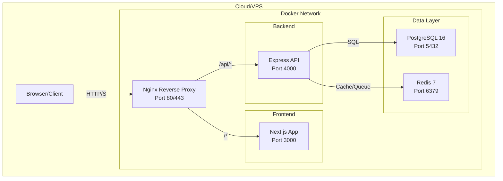

# Infrastructure Documentation

## Deployment Topology



## Container Configuration

### Nginx
- **Image**: `nginx:alpine`
- **Ports**: `80:80`, `443:443` (SSL)
- **Config**: `nginx/nginx.conf`
- **Role**: Reverse proxy, static asset serving, SSL termination

### Frontend
- **Image**: Custom Dockerfile (Node.js 18 + Next.js)
- **Port**: `3000`
- **Build**: `npm run build` → `npm start`
- **Output**: Standalone mode

### Backend
- **Image**: Custom Dockerfile (Node.js 18 + TypeScript)
- **Port**: `4000`
- **Build**: `tsc` → `node dist/index.js`
- **Health Check**: `GET /health`

### PostgreSQL
- **Image**: `postgres:16-alpine`
- **Port**: `5432` (internal only)
- **Volumes**: 
  - `postgres_data` (persistent data)
  - `db-backup` (backup scripts)
- **Schemas**: auth_schema, admin_schema, audit_schema, crm_schema, finance_schema, task_schema

### Redis
- **Image**: `redis:7-alpine`
- **Port**: `6379` (internal only)
- **Use**: Session refresh tokens, BullMQ queues

## Volume Mounts

| Volume | Type | Purpose |
|--------|------|---------|
| `postgres_data` | Named Volume | Persistent database storage |
| `backend/node_modules` | Bind Mount | Dev dependency installation |
| `frontend/node_modules` | Bind Mount | Dev dependency installation |
| `./backend/db-backup` | Bind Mount | Database backup scripts |

## Network Configuration

```yaml
# docker-compose.yml (conceptual)
networks:
  sourcecorp-network:
    driver: bridge
    ipam:
      config:
        - subnet: 172.20.0.0/16
```

## SSL/TLS

### Development
- HTTP only (no SSL)

### Production
```nginx
server {
    listen 443 ssl http2;
    server_name platform.sourcecorp.com;
    
    ssl_certificate /etc/nginx/ssl/cert.pem;
    ssl_certificate_key /etc/nginx/ssl/key.pem;
    ssl_protocols TLSv1.2 TLSv1.3;
    ssl_ciphers 'ECDHE-ECDSA-AES128-GCM-SHA256:ECDHE-RSA-AES128-GCM-SHA256';
    
    location /api/ {
        proxy_pass http://backend:4000;
        proxy_set_header Host $host;
        proxy_set_header X-Real-IP $remote_addr;
    }
    
    location / {
        proxy_pass http://frontend:3000;
        proxy_set_header Host $host;
    }
}
```

## Monitoring Stack (Recommended)

| Tool | Purpose | Integration |
|------|---------|-------------|
| Prometheus | Metrics collection | Scrape /metrics endpoint |
| Grafana | Visualization | Dashboard for API latency, DB connections |
| Loki | Log aggregation | Collect Winston logs |
| AlertManager | Alerting | High error rate, high latency |

## Backup Strategy

### Database
```bash
# Automated daily backup
docker exec sourcecorp-postgres pg_dump -U postgres sourcecorp > backup_$(date +%Y%m%d).sql

# Restore
docker exec -i sourcecorp-postgres psql -U postgres sourcecorp < backup_20240101.sql
```

### File Uploads
Currently stored in container memory. **Recommendation**: 
- Mount persistent volume: `./uploads:/app/uploads`
- OR use S3-compatible object storage (MinIO)

## Environment Tiers

| Tier | URL | SSL | Monitoring |
|------|-----|-----|------------|
| Development | localhost:3000 | No | Console logs |
| Staging | staging.sourcecorp.com | Yes | Basic |
| Production | platform.sourcecorp.com | Yes | Full |

## Resource Limits (Recommended)

```yaml
# docker-compose production overrides
deploy:
  resources:
    limits:
      cpus: '2.0'
      memory: 1G
    reservations:
      cpus: '1.0'
      memory: 512M
```

## Disaster Recovery

| Scenario | Recovery Time | Method |
|----------|--------------|--------|
| Container crash | < 1 min | `docker-compose restart` |
| Single node failure | < 5 min | Restore from latest backup |
| Database corruption | < 30 min | Restore from daily backup |
| Complete data loss | < 2 hours | Restore from offsite backup |
