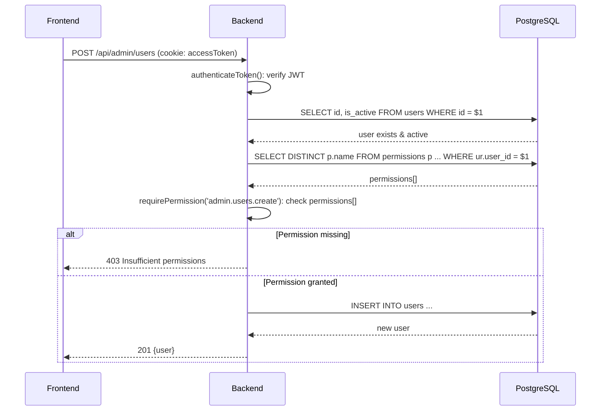

# RBAC Recreation Template

> **Purpose:** A re-creatable blueprint for building a **Role-Based Access Control (RBAC)** system with user creation, role creation, permissions, and a permission-aware UI. This template is derived from the SourceCorp platform and is designed to be reusable in other projects.

---

## 1. Overview

This template describes a complete RBAC system with the following characteristics:

- **Backend:** Node.js + Express + PostgreSQL (raw SQL via `pg`).
- **Frontend:** Next.js + React + TypeScript + Tailwind CSS.
- **Auth:** JWT access tokens + refresh tokens (Redis) + httpOnly cookies.
- **Permission model:** Roles are collections of permissions; users receive permissions through their assigned roles.
- **Security:** Every API endpoint is protected by authentication and optionally by a required permission.

### Core Flow

```text
User ──has──> Roles ──have──> Permissions
```

A request to a protected resource follows this flow:

1. **Authenticate:** Verify JWT access token (from cookie or `Authorization` header).
2. **Authorize:** Resolve the user's effective permissions by joining `users → user_roles → roles → role_permissions → permissions`.
3. **Enforce:** Reject the request with `403` if the required permission is missing.

---

## 2. Database Schema Template

Use a dedicated schema (e.g., `auth_schema`) for all RBAC tables.

```sql
-- Users table
CREATE TABLE IF NOT EXISTS auth_schema.users (
    id UUID PRIMARY KEY DEFAULT uuid_generate_v4(),
    email VARCHAR(255) UNIQUE NOT NULL,
    password_hash VARCHAR(255) NOT NULL,
    first_name VARCHAR(100) NOT NULL,
    last_name VARCHAR(100) NOT NULL,
    is_active BOOLEAN DEFAULT true,
    created_at TIMESTAMP DEFAULT CURRENT_TIMESTAMP,
    updated_at TIMESTAMP DEFAULT CURRENT_TIMESTAMP
);

-- Roles table
CREATE TABLE IF NOT EXISTS auth_schema.roles (
    id UUID PRIMARY KEY DEFAULT uuid_generate_v4(),
    name VARCHAR(100) UNIQUE NOT NULL,
    description TEXT,
    created_at TIMESTAMP DEFAULT CURRENT_TIMESTAMP,
    updated_at TIMESTAMP DEFAULT CURRENT_TIMESTAMP
);

-- Permissions table
CREATE TABLE IF NOT EXISTS auth_schema.permissions (
    id UUID PRIMARY KEY DEFAULT uuid_generate_v4(),
    name VARCHAR(100) UNIQUE NOT NULL,
    description TEXT,
    created_at TIMESTAMP DEFAULT CURRENT_TIMESTAMP,
    updated_at TIMESTAMP DEFAULT CURRENT_TIMESTAMP
);

-- Role ↔ Permission mapping
CREATE TABLE IF NOT EXISTS auth_schema.role_permissions (
    id UUID PRIMARY KEY DEFAULT uuid_generate_v4(),
    role_id UUID NOT NULL REFERENCES auth_schema.roles(id) ON DELETE CASCADE,
    permission_id UUID NOT NULL REFERENCES auth_schema.permissions(id) ON DELETE CASCADE,
    created_at TIMESTAMP DEFAULT CURRENT_TIMESTAMP,
    UNIQUE(role_id, permission_id)
);

-- User ↔ Role mapping
CREATE TABLE IF NOT EXISTS auth_schema.user_roles (
    id UUID PRIMARY KEY DEFAULT uuid_generate_v4(),
    user_id UUID NOT NULL REFERENCES auth_schema.users(id) ON DELETE CASCADE,
    role_id UUID NOT NULL REFERENCES auth_schema.roles(id) ON DELETE CASCADE,
    created_at TIMESTAMP DEFAULT CURRENT_TIMESTAMP,
    UNIQUE(user_id, role_id)
);

-- Indexes
CREATE INDEX IF NOT EXISTS idx_users_email ON auth_schema.users(email);
CREATE INDEX IF NOT EXISTS idx_users_active ON auth_schema.users(is_active);
CREATE INDEX IF NOT EXISTS idx_user_roles_user_id ON auth_schema.user_roles(user_id);
CREATE INDEX IF NOT EXISTS idx_user_roles_role_id ON auth_schema.user_roles(role_id);
CREATE INDEX IF NOT EXISTS idx_role_permissions_role_id ON auth_schema.role_permissions(role_id);
CREATE INDEX IF NOT EXISTS idx_role_permissions_permission_id ON auth_schema.role_permissions(permission_id);
```

### Design Decisions

- **Users do not store permissions directly.** Permissions are always inherited from roles.
- **Many-to-many mappings** allow flexible role-permission and user-role assignments.
- **ON DELETE CASCADE** ensures cleanup when users, roles, or permissions are deleted.
- **UUID primary keys** are used for all entities.

---

## 3. Backend Implementation

### 3.1 TypeScript Interfaces

```ts
export interface User {
  id: string;
  email: string;
  first_name: string;
  last_name: string;
  is_active: boolean;
  created_at: Date;
  updated_at: Date;
}

export interface Role {
  id: string;
  name: string;
  description: string | null;
  created_at: Date;
  updated_at: Date;
}

export interface Permission {
  id: string;
  name: string;
  description: string | null;
  created_at: Date;
  updated_at: Date;
}
```

### 3.2 User Creation Flow

**API endpoint:** `POST /api/admin/users`  
**Required permission:** `admin.users.create`

**Controller logic:**

```ts
static async createUser(req: AuthRequest, res: Response) {
  const { email, password, firstName, lastName } = req.body;
  const passwordHash = await hashPassword(password);

  const result = await query(
    `INSERT INTO auth_schema.users (email, password_hash, first_name, last_name, is_active)
     VALUES ($1, $2, $3, $4, $5)
     RETURNING id, email, first_name, last_name, is_active, created_at`,
    [email, passwordHash, firstName, lastName, true]
  );

  // Optional: audit log
  await AuditService.createLog({
    action: 'USER_CREATED',
    performedBy: req.user.userId,
    targetUserId: result.rows[0].id,
  });

  res.status(201).json(result.rows[0]);
}
```

**Validation schema:**

```ts
export const createUserSchema = z.object({
  body: z.object({
    email: z.string().email('Invalid email format'),
    password: z.string().min(8, 'Password must be at least 8 characters'),
    firstName: z.string().min(1, 'First name is required'),
    lastName: z.string().min(1, 'Last name is required'),
  }),
});
```

### 3.3 Role Creation Flow

**API endpoint:** `POST /api/admin/roles`  
**Required permission:** `admin.roles.create`

```ts
static async createRole(req: AuthRequest, res: Response) {
  const { name, description } = req.body;

  const result = await query(
    `INSERT INTO auth_schema.roles (name, description)
     VALUES ($1, $2)
     RETURNING id, name, description, created_at`,
    [name, description || null]
  );

  res.status(201).json(result.rows[0]);
}
```

### 3.4 Permission Creation Flow

**API endpoint:** `POST /api/admin/permissions`  
**Required permission:** `admin.permissions.create`

```ts
static async createPermission(req: AuthRequest, res: Response) {
  const { name, description } = req.body;

  const result = await query(
    `INSERT INTO auth_schema.permissions (name, description)
     VALUES ($1, $2)
     RETURNING id, name, description, created_at`,
    [name, description || null]
  );

  res.status(201).json(result.rows[0]);
}
```

### 3.5 Permission Naming Convention

Use dot-namespaced permission strings: `<resource>.<action>` or `<module>.<resource>.<action>`.

```text
admin.users.create
admin.users.read
admin.users.update
admin.users.delete
admin.users.assign_role
admin.users.remove_role

admin.roles.create
admin.roles.read
admin.roles.update
admin.roles.delete
admin.roles.assign_permission
admin.roles.remove_permission

admin.permissions.create
admin.permissions.read
admin.permissions.update
admin.permissions.delete

crm.case.create
crm.case.view
crm.case.assign
crm.case.update_status
crm.case.upload_document

finance.eligibility.calculate
finance.obligation.create
```

### 3.6 Assigning Roles to Users

**Assign:** `POST /api/admin/users/:userId/roles`  
**Remove:** `DELETE /api/admin/users/:userId/roles/:roleId`  
**Required permissions:** `admin.users.assign_role`, `admin.users.remove_role`

```ts
static async assignRole(req: AuthRequest, res: Response) {
  const { userId } = req.params;
  const { roleId } = req.body;

  await query(
    `INSERT INTO auth_schema.user_roles (user_id, role_id)
     VALUES ($1, $2)
     ON CONFLICT (user_id, role_id) DO NOTHING`,
    [userId, roleId]
  );

  res.status(200).json({ message: 'Role assigned' });
}
```

### 3.7 Assigning Permissions to Roles

**Assign:** `POST /api/admin/roles/:roleId/permissions`  
**Remove:** `DELETE /api/admin/roles/:roleId/permissions/:permissionId`  
**Required permissions:** `admin.roles.assign_permission`, `admin.roles.remove_permission`

```ts
static async assignPermission(req: AuthRequest, res: Response) {
  const { roleId } = req.params;
  const { permissionId } = req.body;

  await query(
    `INSERT INTO auth_schema.role_permissions (role_id, permission_id)
     VALUES ($1, $2)
     ON CONFLICT (role_id, permission_id) DO NOTHING`,
    [roleId, permissionId]
  );

  res.status(200).json({ message: 'Permission assigned' });
}
```

### 3.8 Authentication Middleware

```ts
export const authenticateToken = async (req: AuthRequest, res: Response, next: NextFunction) => {
  let token = req.cookies?.accessToken;

  if (!token) {
    const authHeader = req.headers['authorization'];
    token = authHeader && authHeader.split(' ')[1];
  }

  if (!token) return res.status(401).json({ error: 'Access token required' });

  const payload = verifyAccessToken(token);
  if (!payload) return res.status(401).json({ error: 'Invalid token' });

  const userResult = await query(
    'SELECT id, email, is_active FROM auth_schema.users WHERE id = $1',
    [payload.userId]
  );

  if (userResult.rows.length === 0) return res.status(401).json({ error: 'User not found' });
  if (!userResult.rows[0].is_active) return res.status(401).json({ error: 'User is inactive' });

  req.user = payload;
  next();
};
```

### 3.9 RBAC Middleware

```ts
export const requirePermission = (requiredPermission: string) => {
  return async (req: AuthRequest, res: Response, next: NextFunction) => {
    if (!req.user) return res.status(401).json({ error: 'Authentication required' });

    const result = await query(
      `SELECT DISTINCT p.name
       FROM auth_schema.permissions p
       JOIN auth_schema.role_permissions rp ON p.id = rp.permission_id
       JOIN auth_schema.roles r ON rp.role_id = r.id
       JOIN auth_schema.user_roles ur ON r.id = ur.role_id
       WHERE ur.user_id = $1`,
      [req.user.userId]
    );

    const userPermissions = result.rows.map((row) => row.name);
    req.userPermissions = userPermissions;

    if (!userPermissions.includes(requiredPermission)) {
      return res.status(403).json({ error: 'Insufficient permissions', required: requiredPermission });
    }

    next();
  };
};

// Allow any one of several permissions
export const requireAnyPermission = (requiredPermissions: string[]) => {
  return async (req: AuthRequest, res: Response, next: NextFunction) => {
    if (!req.user) return res.status(401).json({ error: 'Authentication required' });

    const result = await query(
      `SELECT DISTINCT p.name
       FROM auth_schema.permissions p
       JOIN auth_schema.role_permissions rp ON p.id = rp.permission_id
       JOIN auth_schema.roles r ON rp.role_id = r.id
       JOIN auth_schema.user_roles ur ON r.id = ur.role_id
       WHERE ur.user_id = $1`,
      [req.user.userId]
    );

    const userPermissions = result.rows.map((row) => row.name);
    const hasPermission = requiredPermissions.some((p) => userPermissions.includes(p));

    if (!hasPermission) {
      return res.status(403).json({ error: 'Insufficient permissions', required: requiredPermissions });
    }

    next();
  };
};
```

### 3.10 API Endpoint Map

| Method | Endpoint | Required Permission |
|--------|----------|---------------------|
| POST | `/api/admin/users` | `admin.users.create` |
| GET | `/api/admin/users` | `admin.users.read` |
| GET | `/api/admin/users/:id` | `admin.users.read` |
| PATCH | `/api/admin/users/:id` | `admin.users.update` |
| DELETE | `/api/admin/users/:id` | `admin.users.delete` |
| POST | `/api/admin/users/:userId/roles` | `admin.users.assign_role` |
| DELETE | `/api/admin/users/:userId/roles/:roleId` | `admin.users.remove_role` |
| POST | `/api/admin/roles` | `admin.roles.create` |
| GET | `/api/admin/roles` | `admin.roles.read` |
| GET | `/api/admin/roles/:id` | `admin.roles.read` |
| PATCH | `/api/admin/roles/:id` | `admin.roles.update` |
| DELETE | `/api/admin/roles/:id` | `admin.roles.delete` |
| POST | `/api/admin/roles/:roleId/permissions` | `admin.roles.assign_permission` |
| DELETE | `/api/admin/roles/:roleId/permissions/:permissionId` | `admin.roles.remove_permission` |
| POST | `/api/admin/permissions` | `admin.permissions.create` |
| GET | `/api/admin/permissions` | `admin.permissions.read` |
| GET | `/api/admin/permissions/:id` | `admin.permissions.read` |
| PATCH | `/api/admin/permissions/:id` | `admin.permissions.update` |
| DELETE | `/api/admin/permissions/:id` | `admin.permissions.delete` |
| GET | `/api/auth/me` | Authenticated |

### 3.11 `/auth/me` Response

Return the current user's profile, roles, and flat permission list:

```json
{
  "id": "uuid",
  "email": "admin@example.com",
  "firstName": "Admin",
  "lastName": "User",
  "isActive": true,
  "roles": ["Admin"],
  "permissions": [
    "admin.users.create",
    "admin.users.read",
    "admin.roles.create",
    "..."
  ]
}
```

---

## 4. Frontend Implementation

### 4.1 Auth Context

A React context stores the current user and exposes permission helpers.

```tsx
interface AuthContextType {
  user: User | null;
  loading: boolean;
  login: (credentials: LoginCredentials) => Promise<void>;
  logout: () => Promise<void>;
  hasPermission: (permission: string) => boolean;
  hasAnyPermission: (permissions: string[]) => boolean;
}

const hasPermission = (permission: string): boolean => {
  return user?.permissions?.includes(permission) ?? false;
};

const hasAnyPermission = (permissions: string[]): boolean => {
  return permissions.some((permission) => hasPermission(permission));
};
```

### 4.2 Protected Route

```tsx
interface ProtectedRouteProps {
  children: React.ReactNode;
  requiredPermission?: string;
  requiredAnyPermissions?: string[];
}

export const ProtectedRoute = ({
  children,
  requiredPermission,
  requiredAnyPermissions,
}: ProtectedRouteProps) => {
  const { user, loading, hasPermission, hasAnyPermission } = useAuth();

  if (loading) return <LoadingSpinner />;
  if (!user) return redirect('/login');

  if (requiredPermission && !hasPermission(requiredPermission)) {
    return <AccessDenied />;
  }

  if (requiredAnyPermissions && !hasAnyPermission(requiredAnyPermissions)) {
    return <AccessDenied />;
  }

  return <>{children}</>;
};
```

### 4.3 API Client

Use an Axios instance with cookie-based auth and 401 refresh handling.

```ts
export const api = axios.create({
  baseURL: process.env.NEXT_PUBLIC_API_URL || 'http://localhost:4000/api',
  headers: { 'Content-Type': 'application/json' },
  withCredentials: true,
});

api.interceptors.response.use(
  (response) => response,
  async (error) => {
    const originalRequest = error.config;

    if (error.response?.status === 401 && !originalRequest._retry) {
      originalRequest._retry = true;
      try {
        await api.post('/auth/refresh');
        return api(originalRequest);
      } catch (refreshError) {
        window.location.href = '/login';
        return Promise.reject(refreshError);
      }
    }

    return Promise.reject(error);
  }
);
```

### 4.4 Sidebar / Navigation Permissions

Define each nav item with a required permission. Filter items using `hasPermission()`.

```tsx
interface NavItem {
  name: string;
  href: string;
  icon: React.ComponentType;
  permission: string;
}

const navSections: NavSection[] = [
  {
    title: 'Administration',
    items: [
      { name: 'Users', href: '/admin/users', icon: UsersIcon, permission: 'admin.users.read' },
      { name: 'Roles', href: '/admin/roles', icon: ShieldIcon, permission: 'admin.roles.read' },
      { name: 'Teams', href: '/admin/teams', icon: UsersRoundIcon, permission: 'admin.teams.read' },
    ],
  },
];

// Hide items the user cannot access
const filteredItems = section.items.filter(
  (item) => !item.permission || hasPermission(item.permission)
);

// Hide entire admin section if empty
if (section.title === 'Administration' && filteredItems.length === 0) {
  return null;
}
```

### 4.5 User Management Page

**Features:**

- Table listing users with columns: Name/Email, Roles, Status, Actions.
- Create User modal (email, password, first name, last name).
- Edit User modal (same fields + active checkbox).
- Manage Roles modal (checkbox list of all roles).
- Delete user action.

**API calls:**

```ts
api.get('/admin/users');
api.get('/admin/users/${id}');
api.post('/admin/users', formData);
api.patch('/admin/users/${id}', data);
api.delete('/admin/users/${id}');
api.post('/admin/users/${id}/roles', { roleId });
api.delete('/admin/users/${id}/roles/${roleId}');
```

**Role chips in table:**

```tsx
<div className="flex flex-wrap gap-1">
  {user.roles?.length > 0 ? (
    user.roles.map((role) => (
      <span key={role} className="px-2 py-1 bg-primary-100 text-primary-700 rounded text-xs">
        {role}
      </span>
    ))
  ) : (
    <span className="text-gray-400 text-sm">No roles</span>
  )}
</div>
```

### 4.6 Role Management Page

**Features:**

- Table listing roles with columns: Name/Description, Users count, Permissions count, Actions.
- Create Role modal (name, description).
- Edit Role modal.
- Manage Permissions modal (grouped checkboxes with Select All / Deselect All).
- Delete role action.

**API calls:**

```ts
api.get('/admin/roles');
api.get('/admin/roles/${id}');
api.post('/admin/roles', formData);
api.patch('/admin/roles/${id}', formData);
api.delete('/admin/roles/${id}');
api.get('/admin/permissions');
api.post('/admin/roles/${id}/permissions', { permissionId });
api.delete('/admin/roles/${id}/permissions/${permissionId}');
```

**Permission grouping:**

```ts
const grouped = permissions.reduce((acc, permission) => {
  const category = permission.name.split('.')[0];
  if (!acc[category]) acc[category] = [];
  acc[category].push(permission);
  return acc;
}, {} as Record<string, Permission[]>);
```

### 4.7 Granular UI Enforcement

Hide buttons/actions based on permissions:

```tsx
{hasPermission('crm.case.assign') && <Button>Assign Case</Button>}
{hasPermission('crm.case.update_status') && <Button>Update Status</Button>}
{hasPermission('crm.case.delete') && <Button variant="danger">Delete</Button>}
```

> **Note:** Server-side enforcement is mandatory. Frontend hiding is a UX improvement only.

---

## 5. How They Work Together

### 5.1 Full Request Lifecycle



### 5.2 Login → Permission Flow

1. User submits credentials.
2. Backend validates password and generates JWT access + refresh tokens.
3. Backend resolves roles and permissions.
4. Frontend stores user object (including `permissions: string[]`).
5. `AuthContext` exposes `hasPermission()` and `hasAnyPermission()`.
6. Sidebar and UI use helpers to show/hide elements.
7. Every protected API call re-validates the token and re-resolves permissions server-side.

### 5.3 Role/Permission Assignment Flow

```text
Admin opens Roles page
  → sees list of roles
  → clicks Manage Permissions
  → sees grouped permissions
  → toggles checkboxes
  → each toggle calls POST/DELETE /admin/roles/:id/permissions
  → role now has updated permissions

Admin opens Users page
  → sees list of users
  → clicks Manage Roles
  → sees checkbox list of roles
  → toggles checkboxes
  → each toggle calls POST/DELETE /admin/users/:id/roles
  → user now has updated roles and inherited permissions
```

---

## 6. Seed / Default Admin Script Template

Always provide a script to create the first admin user and role. This prevents lockout after deployment.

### SQL Seed Template

```sql
-- Create admin user (password should be hashed by application code in production)
INSERT INTO auth_schema.users (email, password_hash, first_name, last_name, is_active)
VALUES ('admin@example.com', '$2b$10$...', 'System', 'Administrator', true)
ON CONFLICT (email) DO NOTHING;

-- Create Admin role
INSERT INTO auth_schema.roles (name, description)
VALUES ('Admin', 'System Administrator')
ON CONFLICT (name) DO NOTHING;

-- Create base admin permissions
INSERT INTO auth_schema.permissions (name, description) VALUES
('admin.users.create', 'Create users'),
('admin.users.read', 'View users'),
('admin.users.update', 'Update users'),
('admin.users.delete', 'Delete users'),
('admin.users.assign_role', 'Assign roles to users'),
('admin.users.remove_role', 'Remove roles from users'),
('admin.roles.create', 'Create roles'),
('admin.roles.read', 'View roles'),
('admin.roles.update', 'Update roles'),
('admin.roles.delete', 'Delete roles'),
('admin.roles.assign_permission', 'Assign permissions to roles'),
('admin.roles.remove_permission', 'Remove permissions from roles'),
('admin.permissions.create', 'Create permissions'),
('admin.permissions.read', 'View permissions'),
('admin.permissions.update', 'Update permissions'),
('admin.permissions.delete', 'Delete permissions')
ON CONFLICT (name) DO NOTHING;

-- Assign all permissions to Admin role
INSERT INTO auth_schema.role_permissions (role_id, permission_id)
SELECT r.id, p.id
FROM auth_schema.roles r, auth_schema.permissions p
WHERE r.name = 'Admin'
ON CONFLICT (role_id, permission_id) DO NOTHING;

-- Assign Admin role to admin user
INSERT INTO auth_schema.user_roles (user_id, role_id)
SELECT u.id, r.id
FROM auth_schema.users u, auth_schema.roles r
WHERE u.email = 'admin@example.com' AND r.name = 'Admin'
ON CONFLICT (user_id, role_id) DO NOTHING;
```

### Bash/PowerShell Script Template

A setup script should:

1. Prompt for admin email, first name, last name, and password.
2. Hash the password using the same algorithm as the app.
3. Insert the user, role, permissions, and mappings.
4. Print success message.

---

## 7. Recreation Checklist

Use this checklist when rebuilding this RBAC system in another project.

### Database

- [ ] Create `auth_schema` (or equivalent namespace).
- [ ] Create `users`, `roles`, `permissions` tables.
- [ ] Create `user_roles` and `role_permissions` junction tables.
- [ ] Add indexes on foreign keys and lookup fields.
- [ ] Add `ON DELETE CASCADE` to junction tables.

### Backend

- [ ] Set up password hashing (bcrypt, Argon2, etc.).
- [ ] Implement JWT access + refresh token flow.
- [ ] Create `authenticateToken` middleware.
- [ ] Create `requirePermission` and `requireAnyPermission` middleware.
- [ ] Implement user CRUD endpoints.
- [ ] Implement role CRUD endpoints.
- [ ] Implement permission CRUD endpoints.
- [ ] Implement user-role assignment endpoints.
- [ ] Implement role-permission assignment endpoints.
- [ ] Implement `/auth/me` returning user + roles + permissions.
- [ ] Add input validation (Zod/Joi/class-validator).
- [ ] Add audit logging for admin mutations.

### Frontend

- [ ] Create `AuthContext` with `user`, `login`, `logout`, `hasPermission`, `hasAnyPermission`.
- [ ] Create API client with cookie auth and 401 refresh interceptor.
- [ ] Create `ProtectedRoute` component.
- [ ] Build login page.
- [ ] Build user management page (list, create, edit, delete, manage roles).
- [ ] Build role management page (list, create, edit, delete, manage permissions).
- [ ] Build permission management page (optional, list/create).
- [ ] Wire sidebar navigation to `hasPermission()`.
- [ ] Conditionally hide buttons/actions based on permissions.
- [ ] Handle 403 errors gracefully (alerts/toasts).

### Security

- [ ] Store passwords hashed.
- [ ] Use httpOnly cookies for tokens (or secure storage strategy).
- [ ] Validate every request on the server, never trust the frontend.
- [ ] Rate-limit login and admin endpoints.
- [ ] Use HTTPS in production.
- [ ] Audit log all privileged actions.

### Deployment

- [ ] Provide seed/default admin script.
- [ ] Document environment variables (`JWT_SECRET`, `JWT_REFRESH_SECRET`, `DATABASE_URL`, `REDIS_URL`, etc.).
- [ ] Ensure migrations/seeds run before first use.

---

## 8. Best Practices

1. **Server-side enforcement is the source of truth.** Frontend permission checks improve UX but must not replace backend guards.
2. **Use dot-namespaced permissions.** They are self-documenting and easy to group in the UI.
3. **Resolve permissions per request** or cache them for a short TTL. Avoid putting too much data in the JWT payload.
4. **Seed a default admin role.** Without it, you may lock yourself out after the first deployment.
5. **Audit log mutations.** Track who created users, assigned roles, and changed permissions.
6. **Keep the JWT payload small.** Store only `userId` and `email`; fetch roles/permissions from the database or cache.
7. **Map roles to job functions.** Create roles like `Admin`, `Manager`, `Sales`, `Finance Analyst` rather than assigning permissions directly to users.
8. **Prefer `requireAnyPermission`** for UI actions that can be triggered by multiple authorized roles.
9. **Document your permission catalog.** Maintain a list of all permissions so admins know what each role grants.
10. **Test with least-privilege users.** Ensure users without a permission cannot see data or trigger actions.

---

## 9. Example Project Structure

```
backend/
  src/
    controllers/
      users.controller.ts
      roles.controller.ts
      permissions.controller.ts
      auth.controller.ts
    middleware/
      auth.middleware.ts
      rbac.middleware.ts
      validate.middleware.ts
    routes/
      admin.routes.ts
      auth.routes.ts
    db/
      schema.sql
      seed-admin.sql
      migrate.ts
    types/
      index.ts
    utils/
      password.ts
      jwt.ts
frontend/
  src/
    app/
      (protected)/
        admin/
          users/
            page.tsx
          roles/
            page.tsx
          permissions/
            page.tsx
        layout.tsx
      login/
        page.tsx
    components/
      Sidebar.tsx
      ProtectedRoute.tsx
      Table.tsx
      Modal.tsx
      Button.tsx
      Input.tsx
      Dropdown.tsx
    contexts/
      AuthContext.tsx
    lib/
      api.ts
      auth.ts
```

---

## 10. References

- Backend schema: `backend/src/db/schema.sql`
- Backend controllers: `backend/src/controllers/users.controller.ts`, `roles.controller.ts`, `permissions.controller.ts`
- Backend middleware: `backend/src/middleware/auth.middleware.ts`, `backend/src/middleware/rbac.middleware.ts`
- Backend routes: `backend/src/routes/admin.routes.ts`
- Frontend admin pages: `frontend/src/app/(protected)/admin/users/page.tsx`, `frontend/src/app/(protected)/admin/roles/page.tsx`
- Frontend auth context: `frontend/src/contexts/AuthContext.tsx`
- Frontend sidebar: `frontend/src/components/Sidebar.tsx`
- Existing docs: `docs/AUTH_FLOW.md`, `docs/DATABASE.md`, `olddocs/PERMISSIONS.md`
