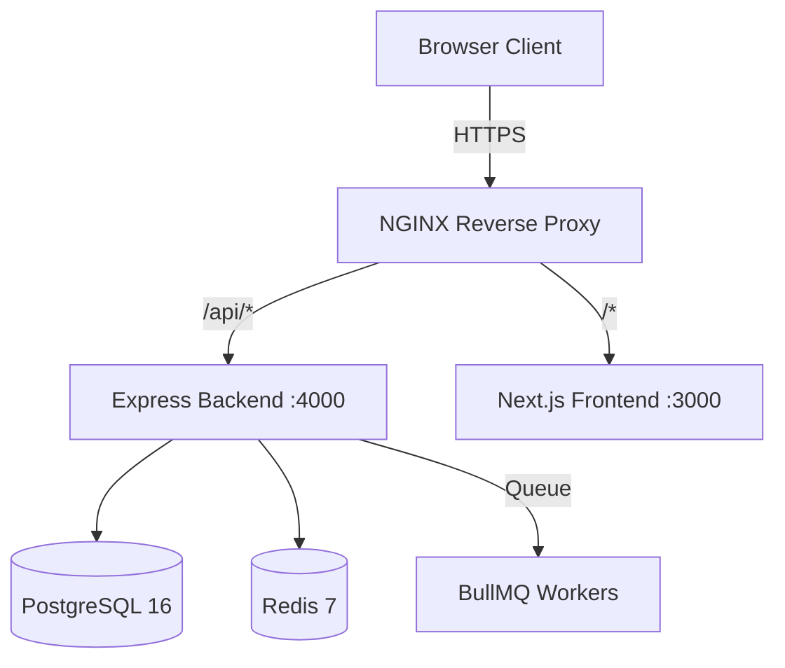

# SourceCorp Solution Platform

**Enterprise Internal Platform for Loan Origination, CRM, and Team Management**

---

## Project Overview

SourceCorp Solution Platform is a comprehensive internal enterprise application built for a financial services organization. It streamlines loan case management, team hierarchy, task assignment, financial assessments (CAM, Obligation Sheets, Eligibility), announcements, and employee recognitions through a modern web interface.

The platform implements strict Role-Based Access Control (RBAC) with hierarchical team structures, audit logging, and real-time productivity tools.

---

## Features

| Module | Features |
|--------|----------|
| **Authentication** | JWT-based auth with refresh tokens, cookie support, RBAC |
| **Admin** | User/Role/Permission/Team management, Audit logs, Announcements, Recognitions |
| **CRM** | Case lifecycle management, document uploads, notes, notifications, customer detail sheets, change request approvals |
| **Hierarchy** | Manager-subordinate relationships, visual org chart, task routing |
| **Tasks** | Hierarchical task assignment (downward/upward), status tracking, comments |
| **Financial Tools** | CAM templates, Obligation sheets, Eligibility calculations, CSV/Excel/PDF exports |
| **Dashboard** | Dynamic announcements, monthly achievers, best employee recognitions |
| **Chat** | Internal messaging system |
| **Notes** | Personal and case-linked notes |

---

## Tech Stack

### Frontend
- **Framework**: Next.js 15 (App Router)
- **Language**: TypeScript
- **Styling**: Tailwind CSS
- **Animation**: Framer Motion
- **Icons**: Lucide React
- **Notifications**: Sonner (toast)
- **Drag & Drop**: @dnd-kit
- **Date Handling**: date-fns

### Backend
- **Runtime**: Node.js + Express 5
- **Language**: TypeScript
- **Database**: PostgreSQL 16 (with JSONB, CTEs, triggers)
- **Cache**: Redis 7 (ioredis)
- **Queue**: BullMQ (Redis-based)
- **Validation**: Zod
- **Auth**: JWT (jsonwebtoken) + bcryptjs
- **Uploads**: Multer (memory storage)
- **Exports**: exceljs, pdfkit, archiver
- **Logging**: Winston

### Infrastructure
- **Reverse Proxy**: NGINX
- **Containerization**: Docker + Docker Compose
- **Database Schemas**: auth_schema, admin_schema, audit_schema, crm_schema, finance_schema, task_schema

---

## Architecture Summary



---

## Installation

### Prerequisites
- Node.js 20+
- PostgreSQL 16
- Redis 7
- Docker (optional)

### Local Setup

```bash
# 1. Clone repository
git clone <repo-url>
cd souercecorp-platform\ v1.0.0

# 2. Backend setup
cd backend
cp .env.example .env  # Configure DB, Redis, JWT secrets
npm install
npm run migrate        # Run all database migrations
npm run dev            # Start on :4000

# 3. Frontend setup (new terminal)
cd ../frontend
npm install
npm run dev            # Start on :3000
```

### Docker Setup

```bash
docker-compose up --build
```

---

## Environment Variables

### Backend (.env)
```env
NODE_ENV=development
PORT=4000
DB_HOST=localhost
DB_PORT=5432
DB_NAME=sourcecorp
DB_USER=sourcecorp_user
DB_PASSWORD=
REDIS_HOST=localhost
REDIS_PORT=6379
JWT_SECRET=your-secret
JWT_REFRESH_SECRET=your-refresh-secret
JWT_EXPIRES_IN=24h
JWT_REFRESH_EXPIRES_IN=7d
CORS_ORIGIN=http://localhost:3000
```

---

## Deployment

See [DEPLOYMENT.md](DEPLOYMENT.md) for production deployment instructions.

---

## Security Overview

- JWT authentication with short-lived access tokens and refresh tokens
- Role-based access control (RBAC) with 60+ granular permissions
- Helmet.js for HTTP security headers
- CORS with credentials
- SQL injection prevention via parameterized queries
- Input validation via Zod schemas
- Audit logging for all critical operations
- Password hashing with bcrypt

See [SECURITY.md](SECURITY.md) for detailed security documentation.

---

## Folder Structure

```
├── backend/
│   ├── src/
│   │   ├── app.ts              # Express app configuration
│   │   ├── index.ts            # Server entry point
│   │   ├── config/             # Environment & logger
│   │   ├── controllers/        # 15 API controllers
│   │   ├── services/           # 11 business services
│   │   ├── routes/             # 8 route modules
│   │   ├── middleware/         # Auth, RBAC, Validation, Error
│   │   ├── validators/         # Zod schemas
│   │   ├── db/                 # Pool, Redis, schema, migrations
│   │   ├── types/              # TypeScript interfaces
│   │   ├── workers/            # Background job workers
│   │   └── assets/             # Static assets
│   └── package.json
├── frontend/
│   ├── src/
│   │   ├── app/                # Next.js App Router pages
│   │   ├── components/         # Reusable UI components
│   │   ├── contexts/           # React contexts (Auth)
│   │   ├── hooks/              # Custom React hooks
│   │   ├── lib/                # API clients & services
│   │   └── utils/              # Utility functions
│   └── package.json
├── nginx/                      # Reverse proxy config
├── docs/                       # Documentation
└── docker-compose.yml
```

---

## API Summary

| Base Path | Description |
|-----------|-------------|
| `/api/auth` | Login, refresh, logout, me |
| `/api/admin` | Users, roles, permissions, teams, hierarchy, announcements, recognitions, audit logs |
| `/api/crm` | Cases, assignments, documents, notes, notifications, customer detail sheets, exports |
| `/api/finance` | Eligibility, CAM, Obligation, exports |
| `/api/finance/templates` | CAM & Obligation template management |
| `/api/users` | User hierarchy endpoints |
| `/api/tasks` | Task CRUD, status updates, comments |
| `/api/notes` | Personal & case notes |

See [API.md](API.md) for full API documentation.

---

## Contributing

See [CONTRIBUTING.md](CONTRIBUTING.md) for development guidelines.

---

## License

Proprietary - SourceCorp Solution Internal Use Only
