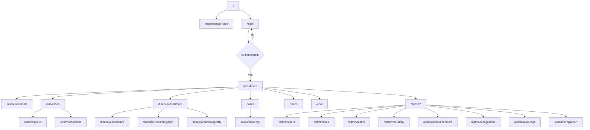

# UI Flow Documentation

## Routing Structure



## Layout Hierarchy

```
RootLayout
├── html + body
└── AuthProvider
    └── (protected)/layout.tsx
        ├── Sidebar (left nav)
        ├── Header (top bar)
        └── Main Content Area
            └── [Page Content]
```

## Protected Routes

All routes inside `(protected)/` require authentication. The `(protected)` route group:
1. Checks for valid JWT token
2. Redirects to `/login` if missing/invalid
3. Renders `Sidebar` + `Header` + page content

## Navigation Flow

### Sidebar Navigation
```
┌─ Dashboard
├─ Announcements
├─ CRM
│  ├─ Cases
│  └─ Notifications
├─ Financial Tools
│  ├─ CAM / Working Sheet
│  ├─ Obligation Sheet
│  └─ Eligibility
├─ Tasks
│  ├─ My Tasks
│  └─ Hierarchical Tasks
├─ Notes
├─ Chat
└─ Admin (conditional)
   ├─ Users
   ├─ Roles
   ├─ Teams
   ├─ Hierarchy
   ├─ Announcements
   ├─ Recognitions
   ├─ Audit Logs
   └─ Templates
      ├─ CAM Templates
      ├─ Obligation Templates
      └─ Customer Detail Template
```

## Global Providers

| Provider | Scope | Purpose |
|----------|-------|---------|
| `AuthProvider` | Root | JWT token, user data, permissions, login/logout |
| `ToastProvider` (Sonner) | Root | Global toast notifications |

## Context/State Management

### AuthContext
```typescript
interface AuthContextType {
  user: User | null;
  isLoading: boolean;
  login: (email, password) => Promise<void>;
  logout: () => void;
  hasPermission: (permission: string) => boolean;
}
```

- Persists token in `localStorage`
- Fetches `/api/auth/me` on mount
- Provides `hasPermission()` for UI gating

## Component Hierarchy

### Dashboard Page
```
PageHeader
└── div (grid layout)
    ├── AnnouncementsSection
    │   └── AnnouncementCard[]
    ├── RecognitionsSection
    │   ├── MonthlyAchieverCard
    │   └── BestEmployeeCard
    └── TaskSummary
```

### CRM Cases Page
```
PageHeader + Create Button
├── FilterBar (status, date, user)
├── SearchInput
└── Table
    ├── CaseRow (with actions)
    └── Pagination
```

### CAM Page
```
PageHeader + FinancialToolsNav
├── CaseSelection
│   ├── SearchInput
│   └── CaseDropdown
├── CAMForm
│   ├── SectionCard[]
│   │   └── FieldInput[]
│   └── CustomFieldsSection
└── ActionBar (Save, Export)
```

## SSR vs CSR

| Page | Strategy | Reason |
|------|----------|--------|
| `/login` | CSR | No auth required, simple form |
| `/dashboard` | CSR | Dynamic data, auth required |
| `/crm/cases` | CSR | Dynamic data, filters |
| `/announcements` | CSR | Dynamic data |
| All admin pages | CSR | Auth + permissions |

**Note**: Next.js 15 App Router is used, but all pages are client components (`'use client'`) because they require auth state and make API calls.

## Error Handling

- **API Errors**: Caught in service layer, thrown to component
- **Component Errors**: Try-catch with toast notification
- **Auth Errors**: 401 → logout + redirect to login
- **Permission Errors**: 403 → toast "Insufficient permissions"

## Lazy Loading

Currently **not implemented**. All pages are eagerly loaded.

**Recommendation**: Add `dynamic()` imports for heavy admin pages:
```typescript
const AdminHierarchy = dynamic(() => import('./admin/hierarchy/page'));
```
